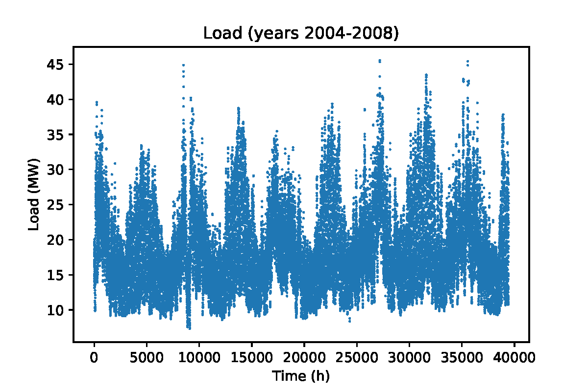
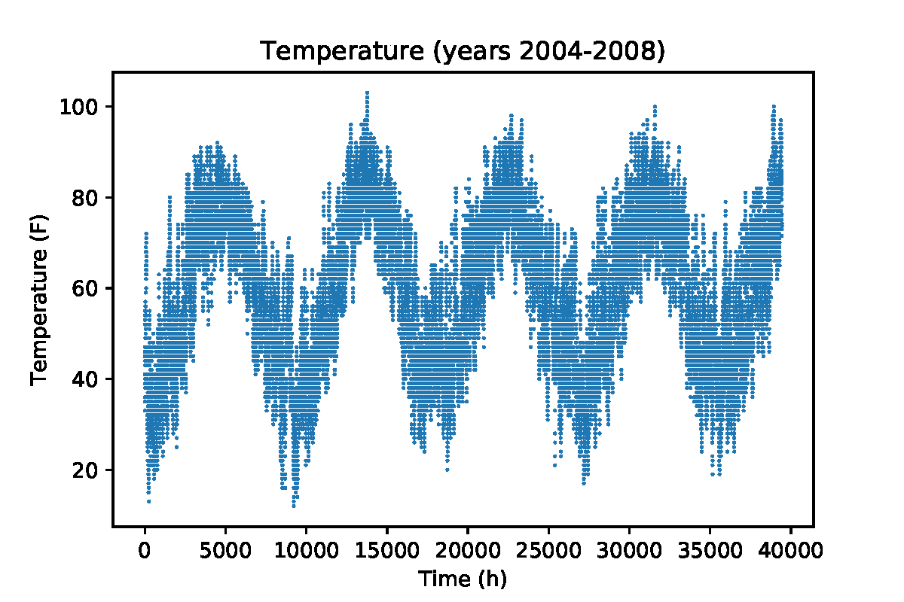
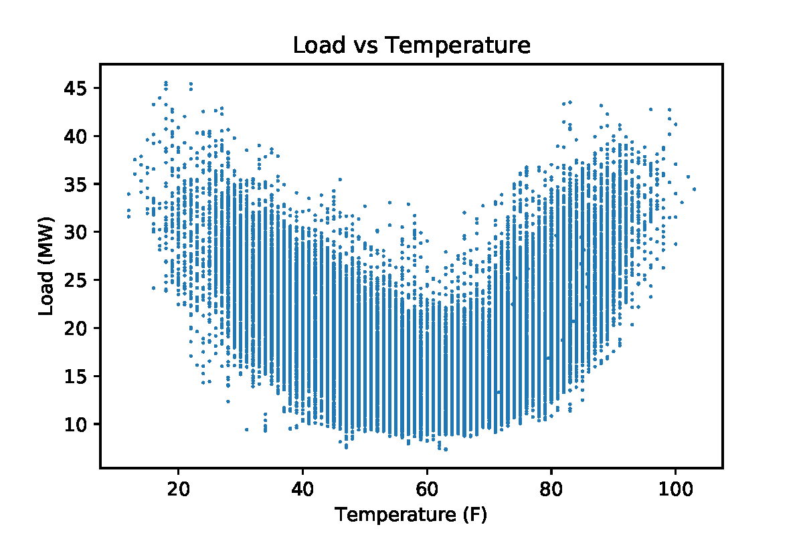

# Multiple linear regression with interaction effects for load forecasting

## Project description
Forecasting electric load accurately lies at the heart of  power  system  operation  routines  such  as  economic  dispatch and optimal power flow. For this reason, there is a lot of interest  on  developing  accurate  models for  predicting  electric  load  over  recent  years.  Prior  art  in  this domain used time-series and linear regression as means for developing good  forecasting  models.  In this project, we use multiple regression with interaction effects and cyclical features encoding to develop a new model that can accurately predict electric load from several features including the temperature.  We  validate  different versions of our  model  and  quantify  their  performance  via both standard  goodness-of-fit-criteria such as the adjusted $R^2$ as well as criteria that rely on the prediction error. 

## Description of files

There are **four** main files in this project repository:

- `dataPrep.py`
- `DataAnalysis.py`
- `holiday_list_conv.py`
- `Load_forecasting.py`

The `dataPrep.py` **Ana describe**

## Project details

### Load-temperature characteristic

From the two figures below, we see that there is high correlation between the peaks and valleys of the temperature and the electric load. This  aligns  well  with  intuition  and  corroborates  the  causal relationship  between  temperature  and  load  that  is,  high  and low  temperature  are  the  main  drivers  behind  the  load  peaks. We  can  hence  forecast  the  load  through  its  relationship  with temperature. 

Using  our  data,  we  plot  the  load  versus  temperature  characteristic to get a feeling of its shape. We  see  that,  this  characteristic  has  predominantly  a  quadratic/cubic  U-shape.  We  note  that,  this curve  is  not symmetric  with  its right  part  exhibiting  steeper  slope  than  the  left  one.  The minimum  of  this curve  appears to be  around  62  F.  Given  the  shape of this curve one easily concludes that piecewise linear, piecewise quadratic, continuous quadratic or cubic functions seem to be the most appropriate functions for capturing the basic relationship between the load and temperature. In this project, we explore both a continuous  quadratic  function and a cubic function to  model  the  load-temperature  relationship. 

### Capturing seasonal effects on Load-temperature characteristic via interaction effects
Having discussed the main form of the load-temperature characteristics, we now explore how the particular month of the year, day of the week, and hour of the day affect the load either directly via energy-demanding human activities or indirectly via changes in the load-temperature relationship.

#### Effect of month of the year on electric load
Summer months are characterized by high temperatures while winter months by low temperatures. Therfore each different month of the year contributes to a different part of the load-temperature characteristic. The months between May and September contribute to the right part while the months between December and March to the left part and the rest of the months to the bottom part. Now, the critical question is:

- Can the same load-temperature characteristic be used to explain the relationship between temperature and load in different months?

To gain more insight, we plot the Load-Temperature characteristic for several months of the year. From these plots, we see that the quantitative relationship between the temperature and the load changes with the months e.g., same temperature leads to different load levels in different months. A few days with high temperatures in May won't lead to the same Load as days with the same temperatures in August because people would probably not turn on AC in May even if the temperature of some days is high. Similarly, a few cold days in September won't result in the same Load as days with the same temperature in October as a lot of central heating systems are scheduled to turn on in October.
It it clear from this analysis that the Load-Temperature characteristic for different months would be different. Therefore, the parameters of the funciton that describes the relationship between the Load and the Temperature really depend on the month under consideration. In regression analysis, this effect can be formally accounted in the model through interaction effects. We consider interaction among the temperature-load  characteristic and each month in our model captured by multiplying the Load-Temperature function with the month variable.

#### Effect of day of the week on the electric load
The Load-Temperature characteristic does not depend on the particular day of the week e.g., the same temperature during the week should lead to the roughly the same Load in a weekday and the weekends, assuming that everything else remains equal. There is no reason for people to react to a particular temperature differently during a weekday than in the weekend. Further, the temperatures during the week wouldn't be different than the temperatures in the weekend. Nevertheless, the load on the weekdays will be different than the load on the weekend primarily due to change in human activities e.g., people engage in different activities on the weekends than on weekdays that demand different energy levels. To consider this direct effect, we use several categorical variables--- Monday, other weekday, Saturday, Sunday, and other Holidays. These variables will take on the values 0 or 1 depending on the day of the week.

#### Effect of hour of the day on the load
The temperature varies with the hour of the day. We want to see whether the load-temperature characteristic depends on the hour of the day. Plotting the load for different hours of the day, we see that the load-temperature characteristic does change with the hour of the day. This aligns with intuition as a low temperature in the middle of the the night won't lead to the same electric load as the same temperature at noon the day after--- people won't wake up and turn on heat in the middle of the night. 
\par To account for this effect, we allow interaction of the load-temperature characteristic with the hour of the day by multiplying the hour the day with the basic characteristic.
\par The hour of the day also affects the load through the heat build-up effect. The temperature at the previous hour will affect the load at the current hour together with the temperature at the current hour. To understanding this, we consider two scenarios. In the first scenario, we consider a winter day where the temperature in the previous hour is higher than the temperature in the curren hour. In this case, the walls of the buildings have stored some heat and thus there is not need for people to ramp up their heating systems at the current hour. In the second scenario, we consider that the temperature in the previous hour is the same with the temperature in the current hour (and equal to the temperature in the current hour of the previous scenario). In this case there is not much heat build-up in the buildings so at the current hour we need to use our heating systems more heavily despite having the same temperature as in the previous scenario.

## Results

